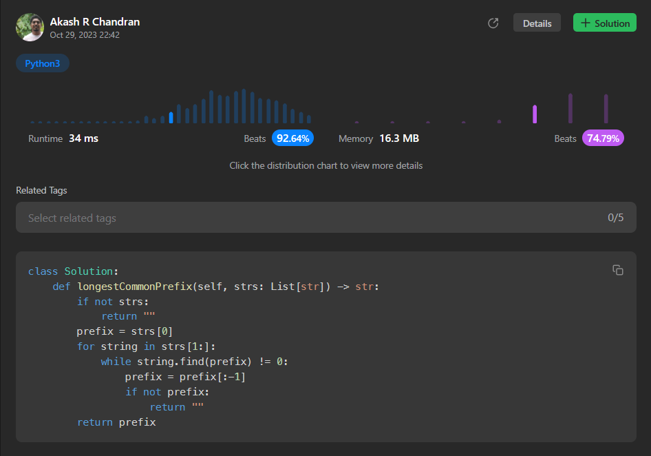

# [8. Longest Common Prefix](https://leetcode.com/problems/longest-common-prefix/)

# Intuition
The problem asks for the longest common prefix among a list of strings. One straightforward approach to solving this problem is to start with the first string as the initial candidate prefix and then compare it with each of the other strings to find the longest common prefix.

# Approach
Here's the approach used in the provided code:
1. First, check if the input list `strs` is empty. If it is, there are no strings to compare, so return an empty string.

2. Initialize the `prefix` variable with the first string in the list, `strs[0]`. This string will serve as the initial candidate prefix.

3. Iterate through the list of strings starting from the second string, `strs[1:]`.

4. For each string in the list, compare it with the current `prefix` using the `string.find(prefix)` method. If the result is not 0, it means the current prefix is not a common prefix for the string.

5. In such a case, remove the last character from the `prefix` by slicing it as `prefix = prefix[:-1]`. This shortens the `prefix` by one character.

6. Repeat step 4 and step 5 until either the `prefix` becomes an empty string or it becomes a common prefix for the current string.

7. If the `prefix` becomes an empty string during the loop, return an empty string, indicating that there is no common prefix among the strings.

8. After the loop, return the `prefix`, which will be the longest common prefix among all the strings.

# Complexity
- Time complexity: 
  - In the worst case, the algorithm iterates through all the characters of the longest string in the list. Therefore, the time complexity is O(N), where N is the total number of characters in all the strings in the list.

- Space complexity:
    - The algorithm uses a constant amount of extra space, so the space complexity is O(1).
    - 
# Code
```
class Solution:
    def longestCommonPrefix(self, strs: List[str]) -> str:
        if not strs:
            return ""
        prefix = strs[0]
        for string in strs[1:]:
            while string.find(prefix) != 0:
                prefix = prefix[:-1]
                if not prefix:
                    return ""
        return prefix
```

## Runtime



## Leetcode Solution Post Link
> [Python](https://leetcode.com/problems/longest-common-prefix/solutions/4223371/easy-python-solution-beats-92-64/)